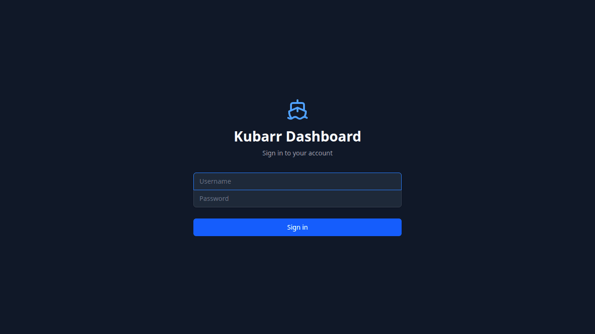

# Kubarr

<p align="center">
  
</p>

[](https://opensource.org/licenses/MIT)
[](https://kubernetes.io/)
[](https://github.com/smokeythebandit/Kubarr/releases)

> A Kubernetes-native dashboard for managing media server applications with security isolation, easy deployment, and comprehensive monitoring.

## Overview

Kubarr is built specifically for managing media server infrastructure on Kubernetes. Deploy and manage your entire media stack—Plex, Sonarr, Radarr, qBittorrent, and more—through a unified dashboard with proper security isolation between applications.

**Core Design Principles:**
- **Security by Separation** - Each application runs in its own namespace with isolated resources and network policies
- **Easy Installation & Updates** - One-click deployment from a curated application catalog with automatic updates
- **Comprehensive Monitoring** - Real-time resource usage, health checks, and application metrics
- **Clean Interface** - Manage everything from a single dashboard without memorizing kubectl commands

## Features

### Application Management

**Media Server Catalog** - Pre-configured templates for popular media applications:
- **Media Servers**: Plex, Jellyfin, Emby
- **Media Management**: Sonarr, Radarr, Lidarr, Readarr
- **Indexers**: Prowlarr, Jackett, NZBHydra2
- **Download Clients**: qBittorrent, SABnzbd, Transmission, Deluge
- **Request Management**: Overseerr, Ombi
- **Subtitle Management**: Bazarr

**One-Click Deployment** - Deploy applications with sensible defaults. Each application automatically gets its own namespace with proper resource limits and network policies.

**Easy Updates** - Update applications to newer versions without manual configuration changes. Helm chart integration handles upgrades cleanly.

### Security & Isolation

**Namespace Separation** - Each application runs in its own Kubernetes namespace, providing resource and network isolation. Applications cannot interfere with each other.

**Authentication & RBAC** - JWT-based authentication with role-based access control. Support for multiple users with different permission levels.

**Network Policies** - Control which applications can communicate with each other. Restrict external access where needed.

**Secret Management** - Encrypted storage for API keys, passwords, and credentials. Edit secrets through the UI without exposing values in logs.

### Monitoring & Troubleshooting

**Real-Time Metrics** - Track CPU, memory, network, and disk usage per application. See resource utilization trends over time.

**Health Checks** - Automatic monitoring of pod health and readiness. Get notified when applications become unhealthy.

**Log Streaming** - View live logs from any application. Filter by container, search for specific messages, and download logs for offline analysis.

**Resource Alerts** - Configure alerts for high resource usage, pod restarts, or application failures.

### Configuration

**Environment Variables** - Edit application settings through a simple interface. Changes restart pods automatically.

**Storage Management** - Visualize persistent volumes and their usage. Attach additional storage to applications as needed.

**Port Management** - Configure service ports and ingress rules. Set up external access with proper security controls.


## Quick Start

### Existing Kubernetes Cluster

If you already have a Kubernetes cluster:

```bash
# Create namespace
kubectl create namespace kubarr

# Install from OCI registry with NodePort access
helm install kubarr oci://ghcr.io/smokeythebandit/kubarr/charts/kubarr -n kubarr \
  --set frontend.service.type=NodePort \
  --set frontend.service.nodePort=30080 \
  --set backend.service.type=NodePort \
  --set backend.service.nodePort=30081

# Wait for pods to be ready
kubectl wait --for=condition=ready pod -l app=kubarr -n kubarr --timeout=300s

# Get node IP
kubectl get nodes -o jsonpath='{.items[0].status.addresses[?(@.type=="InternalIP")].address}'
```

Open `http://<node-ip>:30080` in your browser.

### Local Development

```bash
# Clone the repository
git clone https://github.com/smokeythebandit/Kubarr.git
cd Kubarr

# Build and run the backend
cd code/backend
cargo run

# In another shell, build and run the frontend
cd code/frontend
pnpm install
pnpm dev

# Access the frontend at the Vite dev server URL
```

See [Installation Guide](./docs/installation.md) for detailed setup instructions and advanced configuration.

## Architecture

Kubarr consists of three main components:

- **Backend** (Rust/Axum) - API server with Kubernetes client integration
- **Frontend** (React/TypeScript) - SPA with real-time updates via WebSockets
- **Database** (PostgreSQL) - Application state and configuration storage

```
┌─────────────┐      ┌─────────────┐      ┌─────────────┐
│   Frontend  │─────▶│   Backend   │─────▶│  Kubernetes │
│   (React)   │      │   (Rust)    │      │   Cluster   │
└─────────────┘      └─────────────┘      └─────────────┘
                            │
                            ▼
                     ┌─────────────┐
                     │  Database   │
                     │ (PostgreSQL)│
                     └─────────────┘
```

**Technology Stack:**
- Backend: Rust, Axum, SeaORM, kube-rs
- Frontend: React, TypeScript, Tailwind CSS
- Database: PostgreSQL (production), SQLite (development)
- Deployment: Docker, Kubernetes, Helm

## Documentation

- [Quick Start Guide](./docs/quick-start.md) - Get running in 15 minutes
- [Installation Guide](./docs/installation.md) - Detailed setup instructions
- [Configuration Reference](./docs/configuration.md) - Environment variables and Helm values
- [User Guide](./docs/user-guide.md) - How to use Kubarr effectively
- [Architecture](./docs/architecture.md) - System design and decisions
- [API Documentation](./docs/api.md) - REST API reference
- [Development Guide](./docs/development.md) - Contributing to Kubarr
- [Versioning System](./docs/versioning.md) - Version management and releases

## Contributing

Contributions are welcome! Please see [Development Guide](./docs/development.md) for setup instructions.

- Issues: [GitHub Issues](https://github.com/smokeythebandit/Kubarr/issues)
- Discussions: [GitHub Discussions](https://github.com/smokeythebandit/Kubarr/discussions)
- Security: [SECURITY.md](./code/backend/SECURITY.md)

## License

This project is licensed under the MIT License - see the [LICENSE](./LICENSE) file for details.
