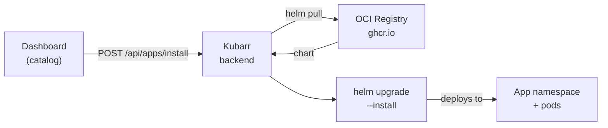

# Applications

Kubarr manages media stack apps as Helm chart releases. You browse a catalog, click install, and Kubarr takes care of pulling the chart, creating the namespace, wiring up storage and VPN, and deploying to your cluster.

---

## The Catalog

The catalog is a list of all apps Kubarr knows how to install. Apps are grouped into categories:

| Category | Apps |
|----------|------|
| **Download clients** | qBittorrent, Transmission, Deluge, SABnzbd, ruTorrent |
| **Media servers** | Jellyfin, Plex |
| **Media managers** | Sonarr, Radarr, Lidarr, and others |
| **Indexers** | Jackett, Prowlarr |
| **Monitoring** | Grafana, VictoriaMetrics, VictoriaLogs |
| **System** | PostgreSQL, Fluent-bit, Cloudflared, Kubernetes Dashboard |

The catalog is populated from the Helm charts in the [kubarr-charts](https://github.com/smokeythebandit/kubarr-charts) repository and kept in sync automatically. You can also trigger a manual sync from the UI.

---

## How Installation Works



When you install an app:

1. Kubarr pulls the latest chart from the OCI registry at `ghcr.io/smokeythebandit/kubarr-charts`
2. A dedicated namespace is created for the app (e.g. `sonarr`)
3. Storage, VPN, and any custom config values are applied
4. Helm runs `upgrade --install` — idempotent, so reinstalling is safe
5. The app becomes accessible through Kubarr's reverse proxy at `/{app-name}/`

Each app runs in complete isolation in its own namespace.

### Operation queue

App installs, updates, restarts, and uninstalls run as queued operations. A queued operation can be **paused** or **canceled**; a paused operation can be **resumed** or **canceled**. These queued/paused cancellations finish immediately. A failed operation can be **retried**, which creates a new operation; first review any partial Helm or Kubernetes effects left by the failed attempt.

Once an operation is running, it cannot be paused, but you can **request stop**. The cancel API returns the operation still `running` with `stop_requested: true`; this acknowledges the request, not completion or rollback. The worker checks for the request, stops Helm if it is still running, and eventually marks the operation `cancelled`. Kubernetes or Helm changes may already have happened, so the external outcome is **indeterminate**: inspect the app and cluster before taking further action. A second stop request is rejected, and only failed operations can be retried through the queue.

The Helm subprocess also has a 12-minute deadline, including a 10-minute Helm wait. If it times out, the outcome may likewise be indeterminate; Kubarr does not automatically replay the operation. Restarting Kubarr is distinct from retrying a task and does not itself retry that task.

---

## Charts

Every app in the catalog is backed by a Helm chart in the [kubarr-charts](https://github.com/smokeythebandit/kubarr-charts) repository. Charts are published to an OCI registry and versioned independently.

Kubarr syncs the chart catalog hourly. When a chart is updated (new image version, new config options, bug fix), Kubarr picks it up automatically. A **Sync** button in the UI lets you pull updates immediately without waiting.

All charts share a consistent set of values:

- **Storage** — shared NFS media volume + per-app config PVC
- **VPN** — optional Gluetun sidecar with kill switch
- **Resources** — CPU and memory requests/limits
- **Network policy** — which namespaces the app can talk to
- **Health checks** — liveness and readiness probes

---

## Custom Configuration

At install time you can override any Helm value. This is passed as a `custom_config` map and forwarded directly to `helm --set`. For example, to install Sonarr with extra memory and a specific image tag:

```json
{
  "app_name": "sonarr",
  "custom_config": {
    "sonarr.image.tag": "4.0.0",
    "sonarr.resources.limits.memory": "2Gi",
    "sonarr.env.PUID": "1001"
  }
}
```

Most chart values can be overridden this way. GPU settings are managed separately; use the GPU selector below rather than `custom_config` for those values.

---

## GPU Transcoding

GPU transcoding requires a compatible device resource to be advertised to Kubernetes before installing the media server. Kubarr does **not** install GPU drivers, device plugins, or the NVIDIA Container Toolkit; prepare these on your cluster nodes yourself:

- **Intel:** install the Intel GPU device plugin with `shared-dev-num` greater than 1 if Plex and Jellyfin must use the same GPU concurrently.
- **NVIDIA:** install the NVIDIA Container Toolkit, configure a working container runtime for GPU pods, and enable time-slicing in the NVIDIA device plugin if the apps must share one GPU.
- **AMD:** use a shared DRM device plugin that specifically advertises the `amd.com/dri` resource. ROCm devices advertising `amd.com/gpu` are unsupported.

In the Kubarr GUI, select a node and GPU resource when installing Plex or Jellyfin, or use **GPU settings** on an installed app to enable, change, or disable it. The backend lists advertised resources at `GET /api/apps/gpu/nodes`. API clients can include `"gpu": {"vendor": "intel", "node_name": "my-node", "resource_name": "gpu.intel.com/i915"}` in an install or update request; `"gpu": null` explicitly disables acceleration on update. GPU support requires an updated media-server chart version that contains the GPU templates.

After deployment, enable hardware transcoding in the media server itself. Plex hardware transcoding requires Plex Pass; in Plex, enable **Use hardware acceleration when available** in Transcoder settings. In Jellyfin, configure the appropriate hardware acceleration and device under Dashboard → Playback → Transcoding. Test by playing media that requires transcoding and confirm the server reports hardware transcoding in its playback/transcoding information.

One advertised GPU slot is a schedulable resource, **not** a physical GPU, a guaranteed share of one, or a guarantee that every codec/format can be accelerated. Actual capabilities depend on the device, drivers, plugin configuration, and media-server support.

---

## VPN

Download clients support an optional VPN through a **Gluetun sidecar** container. When enabled, all traffic from the download client exits through the VPN — the app itself doesn't need any VPN-specific configuration.

Key behaviours:

- **Kill switch** — if the VPN tunnel drops, all internet traffic is blocked until it reconnects
- **LAN passthrough** — traffic to internal cluster IPs is always allowed, so Kubarr can still reach the app
- **Port forwarding** — supported for compatible providers (ProtonVPN, PIA, AirVPN) via NAT-PMP

VPN credentials are stored as a Kubernetes secret in the app's namespace and never exposed through the API.

---

## Uninstalling

Uninstalling an app removes the Helm release and deletes the entire namespace, including all pods, services, and config PVCs. The shared media PVC (`media-data`) and the data on your NFS server are **not** affected — your media library stays intact.

System apps (PostgreSQL, Fluent-bit, etc.) cannot be uninstalled through the UI.
