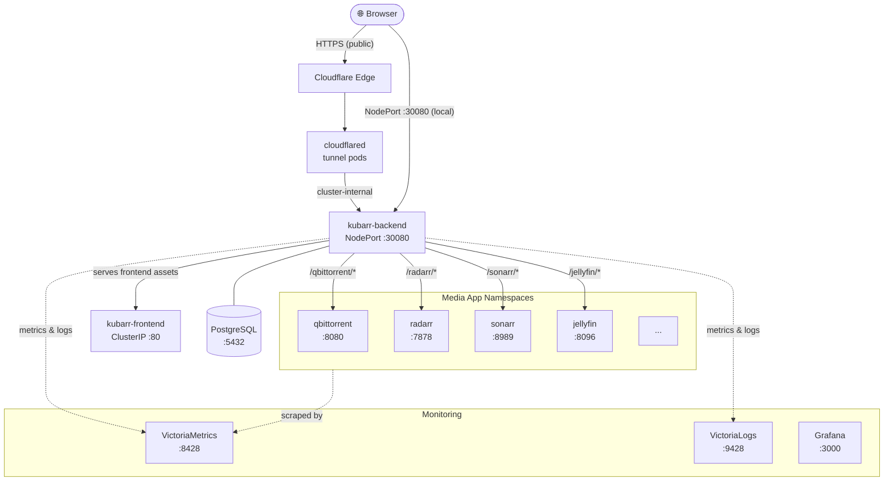
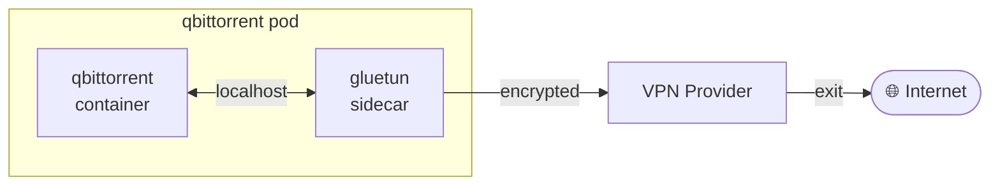

# Networking

Kubarr uses a **reverse proxy architecture** — all traffic to installed apps flows through the Kubarr backend. Apps are never exposed directly to the user. Each app runs in its own namespace, and NetworkPolicies control exactly which namespaces can talk to each other.

---

## Traffic Flow

---

## External Access

There are two ways to reach Kubarr from outside the cluster:

**Cloudflare Tunnel (recommended for public access)**
Two `cloudflared` pods maintain outbound-only connections to Cloudflare's edge. Incoming HTTPS traffic arrives at Cloudflare, travels through the tunnel, and lands directly on the Kubarr backend — no ports need to be opened on your router or firewall.

**NodePort (local network)**
The backend is also exposed as a NodePort on `:30080`, reachable directly from your LAN at `http://<node-ip>:30080`. Useful for local-only setups without Cloudflare.

---

## Frontend & Backend

The frontend is a React SPA served by a BusyBox httpd container over ClusterIP — it is never directly exposed outside the cluster. The backend serves the frontend's static assets and handles all API calls at `/api`. From the browser's perspective there is a single origin; the split between frontend and backend containers is invisible.

---

## App Proxy

The backend reverse-proxies all traffic to installed apps under `/{app}/*`. When a request comes in for, say, `/radarr/api/v3/movie`, the backend:

1. Checks the user has permission to access Radarr
2. Looks up the ClusterIP service for the `radarr` namespace (cached for performance)
3. Forwards the request to `http://radarr.radarr.svc.cluster.local:7878`
4. Streams the response back

WebSocket connections (used for live status updates in apps like qBittorrent) are also proxied transparently.

Apps are never given a public URL of their own — everything goes through Kubarr.

---

## Network Policies

Every namespace has a NetworkPolicy that restricts both inbound and outbound traffic. Nothing can talk to anything unless it is explicitly allowed.

**Kubarr backend** is allowed to reach:
- All media app namespaces (to proxy traffic)
- The `postgresql` namespace on port 5432
- The monitoring stack (VictoriaMetrics, VictoriaLogs, Grafana)
- The Kubernetes API server

**Media apps** allow inbound only from:
- `kubarr` namespace (the proxy)
- Arr apps that integrate with each other (e.g. Sonarr → qBittorrent)
- VictoriaMetrics (metrics scraping)

All other cross-namespace traffic is dropped.

---

## VPN (Sidecar)

Download clients (qBittorrent, Transmission, Deluge, etc.) support an optional **Gluetun sidecar** container. Because all containers in a pod share a network namespace, routing all traffic through the VPN is transparent to the main application container.

A kill switch blocks all internet traffic if the VPN tunnel drops. The firewall is configured to still allow traffic to internal cluster CIDR ranges so Kubarr can continue proxying to the app even when the VPN is active.

---

## Namespace Layout

| Namespace | Contents |
|-----------|----------|
| `kubarr` | Frontend + backend + RBAC |
| `postgresql` | Kubarr's database |
| `radarr`, `sonarr`, `jellyfin`, `plex`, … | One namespace per media app |
| `qbittorrent`, `transmission`, `deluge`, … | One namespace per download client |
| `victoriametrics`, `victorialogs`, `grafana` | Monitoring stack |
| `cloudflared` | Cloudflare Tunnel agent |
